# Supplementary Materials

::: callout-note
## Cross-reference formatting note

In Quarto, cross-references between files require using the `@` symbol with labeled sections. For example, to reference Supplementary Table S1 from the main text, use `[@tbl-supp-tool-config]`. Figure references work similarly with `[@fig-supp-*]` notation.
:::

## Tables

### Supplementary Table S1: Tool Configuration Details {#tbl-supp-tool-config}

For full version and build information see the git repo at [github.com/UriNeri/spacer_matching_bench](https://github.com/UriNeri/spacer_matching_bench).

**Note on tool versions:** Following reviewer suggestions, we added three tools to the benchmark compared to the initial version: Sassy (exhaustive edit distance search), X-mapper (dynamic gapped x-mer approach), and indelfree.sh (BBTools suite, both bruteforce exhaustive mode and indexed heuristic mode). We also updated versions of existing tools where newer releases were available.

**Note on BLASTn parameters:** The parameters for BLASTn were specifically chosen to enable the highest possible recall for short spacers. We used `blastn-short` (sets word-size at 7, compared to 11 with default blastn and 28 in megablastn), a very high number of max target sequences (`-max_target_seqs 1000000`, allowing up to 1M reported alignments per query compared to default value of 500), the `--ungapped` flag (used by CRISPRTarget, aligns with our hamming distance focus), and `perc_identity=84` and `qcov_hsp_perc=80`. The ungapped flag considerably reduced total CPU time. The `perc_identity` and `qcov_hsp_perc` arguments control output size - we cannot restrict blastn to a specific "n" distance, so these values allow a range of distances to be reported. For example, 85% identity over at least 80% of the spacer allows for 3 mismatches for a 20bp spacer (20 \* 0.15 = 3), but allows more for a 30bp spacer (30 \* 0.15 = 4.5). This range exceeds our desired thresholds to capture all valid matches.

| Tool | Version | Command |
|:-----|:--------|:--------|

### Supplementary Table S2: IMG/VR4 Contig Dataset Statistics and Filtering Steps {#tbl-supp-contig-stats}

Summary of IMG/VR4 v1.1 high-confidence viral contigs after taxonomic filtering and length cutoff.

<PLACE_HOLDER> <!-- Should include:
- Starting dataset: 5,457,198 high-confidence contigs from IMG/VR4 v1.1
- Taxonomic filtering steps (removal of eukaryotic virus families, orders, classes)
- Length filtering: contigs ≤1000 bp removed
- Final dataset: 5,115,894 prokaryotic viral contigs
- Size statistics: total ~79 Gbp, range 1,001-2,473,870 bp, median 7,664 bp, GC% 44.45%
- HQ subset selection: 421,431 contigs (~18.9 Gbp) via stratified sampling by taxonomic class
-->

### Supplementary Table S3: CRISPR Spacer Dataset Composition and Statistics {#tbl-supp-spacer-stats}

Detailed statistics on the iPHoP spacer dataset before and after complexity filtering.

<PLACE_HOLDER> <!-- Should include:
- Raw iPHoP dataset: 3,882,812 unique spacers
- Length distribution: range 25-40 bp, median 34 bp (or 25-100 bp based on table in main text)
- GC content: 47.6% (raw), 46.73% (filtered)
- Complexity filtering criteria (entropy ≤1, N fraction >0, homopolymer ≥95%, non-unique 6-mers ≥4)
- Filtered spacers removed: 55,833 (~1.4%)
- Final dataset: 3,826,979 spacers
- Total length: 132 Mbp
- See also Figure S7 for distributions
-->

### Supplementary Table S4: Detailed Statistics for All Datasets {#tbl-supp-simulation-params}
Sequence statistics for all datasets used in this study.
| Dataset / Subset | N Seqs | Total Size (bp) | Length Range (bp) | Mean Length | GC % |
|:---|---:|---:|:---|---:|---:|
| Real Spacers (iPHoP) | 3,826,979 | 129,494,053 | 25-40 | 33.84 | 47.6% |
| Real Data fraction 0.0005 | 279 | 7,036,591 | 1,060-233,373 | 25,220.76 | 48.0% |
| Real Data fraction 0.001 | 421 | 9,745,671 | 1,700-246,318 | 23,148.86 | 48.0% |
| Real Data fraction 0.005 | 2,107 | 57,059,412 | 1,060-618,736 | 27,080.88 | 47.2% |
| Real Data fraction 0.01 | 4,214 | 123,668,270 | 1,060-482,156 | 29,347.00 | 47.3% |
| Real Data fraction 0.05 | 21,071 | 715,073,062 | 1,060-505,259 | 33,936.36 | 47.4% |
| Real Data fraction 0.1 | 42,143 | 1,504,536,616 | 1,060-596,785 | 35,700.75 | 47.5% |
| Real Data fraction 1 | 421,431 | 1,690,774,004 | 1,060-711,471 | 44,777.54 | 47.5% |
| ns_100000_nc_10000 (spacers) | 100,000 | 3,201,222 | 25-40 | 32.01 | 49.0% |
| ns 100000 nc 10000 (contigs) | 10,000 | 802,832,723 | 10,067-149,921 | 80,283.27 | 49.0% |
| ns 100000 nc 20000 (spacers) | 100,000 | 3,200,186 | 25-40 | 32.00 | 49.0% |
| ns 100000 nc 20000 (contigs) | 20,000 | 1,604,143,975 | 10,014-149,390 | 80,207.20 | 49.0% |
| ns 50000 nc 5000 (spacers) | 50,000 | 1,599,652 | 25-40 | 31.99 | 49.1% |
| ns 50000 nc 5000 (contigs) | 5,000 | 402,606,570 | 11,391-149,534 | 80,521.31 | 49.0% |
| ns 75000 nc 5000 (spacers) | 75,000 | 2,401,592 | 25-40 | 32.02 | 49.0% |
| ns 75000 nc 5000 (contigs) | 5,000 | 401,074,812 | 10,244-149,609 | 80,214.96 | 49.0% |
| ns 3826979 nc 421431 (contigs) | 421,431 | 4,291,112,041 | 2,006-100,000 | 50,947.80 | 46.0% |
| ns 500 nc 5000 HIGH INSERTION RATE (spacers) | 500 | 16,007 | 25-39 | 32.01 | 48.9% |
| ns 500 nc 5000 HIGH INSERTION RATE (contigs) | 5,000 | 400,779,688 | 11,241-149,479 | 80,155.94 | 49.0% |

### Supplementary Table S5: Recall Values for Each Tool at Different Mismatch Thresholds {#tbl-supp-recall}

#### A. IMG/VR4 dataset

Every row lists the results for a specific mismatch threshold and tool.\
The values are for exact mismatches (not max), and represent the total number of unique spacer-contig pairs (aligning at that mismatch threshold).\
The fraction is tool_matches divided by total_possible.

| mismatches | tool | total_possible | tool_matches | fraction |
|------------|------|----------------|--------------|----------|

#### B. Synthetic dataset

### Supplementary Table S8: Computational Resource Usage {#tbl-supp-resource-usage}

Detailed resource usage metrics for all completed tool runs on both real (IMG/VR4 subsampled) and simulated datasets. For each tool-dataset combination, we report total CPU time (hours), wall-clock time (hours), peak memory usage (GB), SLURM job ID, and allocated CPU cores. All tools were allocated 64 threads and 512 GB RAM on identical hardware (dual AMD EPYC 7543, see Methods §sec-reproducibility).

**Note on BLASTn fraction_1:** Resource tracking captured data for 1,689,771 of 3,826,979 total spacers. The reported values are extrapolated by a factor of 3826979/1689771 ≈ 2.266, assuming linear scaling with spacer count (validated on smaller fractions). This is annotated in the "note" column of the data files.

**Note on Java-based tools (indelfree.sh):** Peak memory reported by SLURM may overestimate actual requirements due to JVM memory management behavior (see Methods §sec-resource-tracking).

Data files:

- `resource_usage_real_data_completed_jobs.tsv` (real data, all fractions)
- `resource_usage_simulated_completed_jobs.tsv` (all simulated datasets)
- `resource_usage_real_data_failed_jobs.tsv` (timeout/failed jobs)

## Supplementary Figures

### Supplementary Figure S1: Benchmarking framework pipeline overview {#fig-supp-workflow}

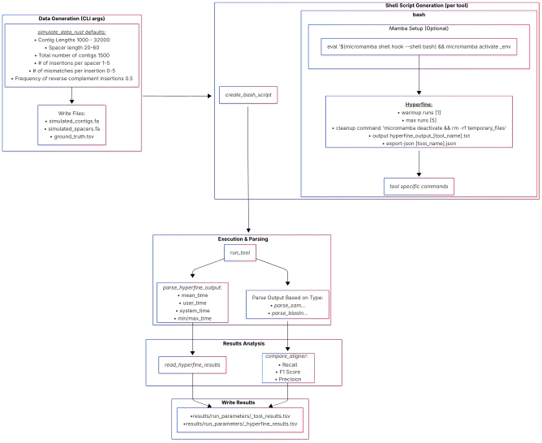 !!! THIS NEEDS TO BE UPDATED !!!

### Supplementary Figure S2: IMG/VR4 tool-vs-tool comparison matrices {#fig-supp-real-matrix}

IMG/VR v4 based results in a tool vs tool comparison. Unlike the similar matrix in the main text (figure 1) which showcases the values for up to 1 and 3 mismatches, here the matrices are separated for each mismatch threshold at an **exact** mismatch value. From top left to bottom right, the mismatch threshold is 0, 1, 2, 3. Like the main text figure, the value of a cell(i,j) is the fraction of spacer-contig pairs identified by the tool listed in row i, which were not identified by the tool listed in the j column.

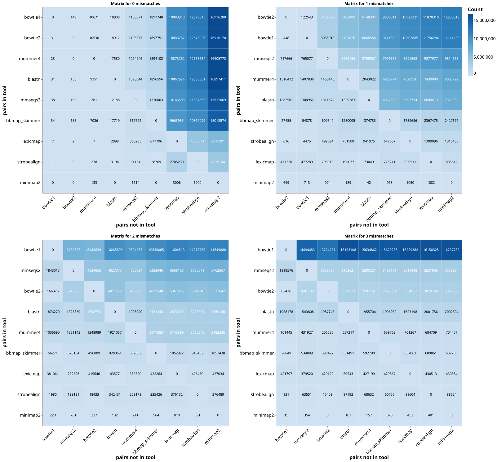

### Supplementary Figure S3: Simulated dataset performance metrics {#fig-supp-sim-performance}

Performance metrics for tools on simulated datasets.\
Precision = True Positives / (True Positives + False Positives)\
Recall = True Positives / (True Positives + False Negatives)\
F1 = 2 \* (Precision \* Recall) / (Precision + Recall)\
Note: Because of the various prefiltering steps, the number of False Negatives and False Positives may not be indicative of the actual raw tool-reported results. As such, we recommend focusing on the recall rate between tools, which is equivalent to the fraction of detected spacer-protospacer pairs out of all the spacer-protospacer pairs in the reference file.

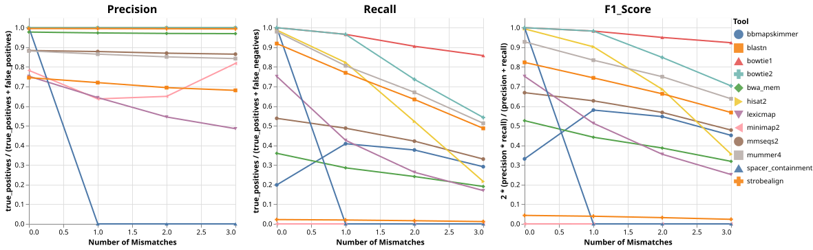

### Supplementary Figure S4: Simulated dataset recall vs spacer occurrence frequency {#fig-supp-sim-recall}

High-occurrence-focused recall view (detection fraction) for the high-insertion simulated dataset (`ns_500_nc_5000_HIGH_INSERTION_RATE`) at hamming distance ≤3.

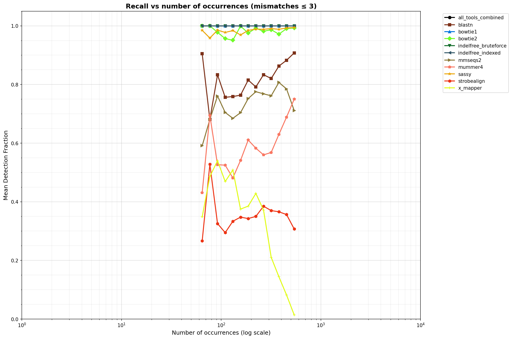

### Supplementary Figure S5: IMG/VR4 fraction_1 recall vs occurrence frequency at hamming distance ≤3 {#fig-supp-real-recall}

High-occurrence-focused recall view for the real IMG/VR4 fraction_1 dataset at hamming distance ≤3.

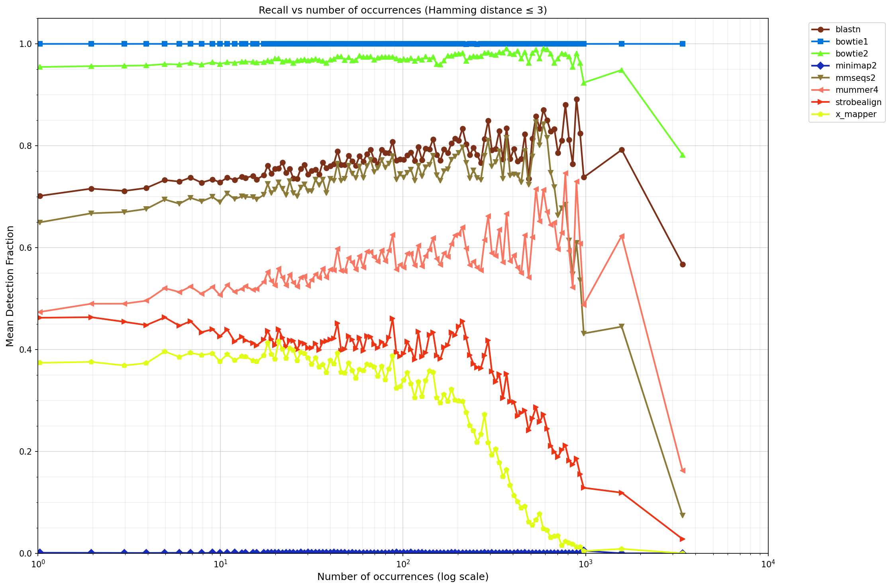

### Supplementary Figure S6: Comparison of simulated vs real spacer characteristics {#fig-supp-spacer-comparison}

Distributions of spacer sequence features comparing simulated and real datasets (1.) to D that synthetic sequences mimic real data characteristics. Features analyzed include k-mer repeatability, Shannon entropy, base frequencies, GC content, and linguistic complexity (LCC). Most features show similar distributions between simulated and real sequences, with some complexity measures (k-mer repeatability and LCC) showing real spacers have slightly wider range of values, suggesting a minor fraction of real spacers have more extreme complexity values.

1.  Filtered iPhoP set:

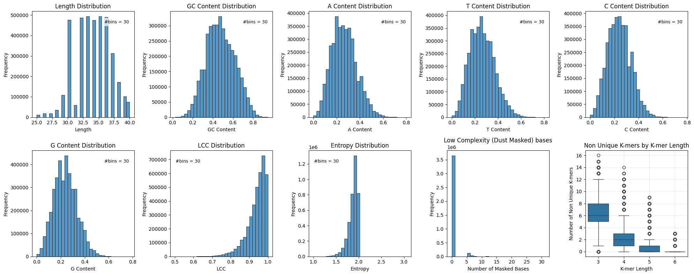

2.  Fully simulated spacer set (specifically: ns_100000_nc_20000)

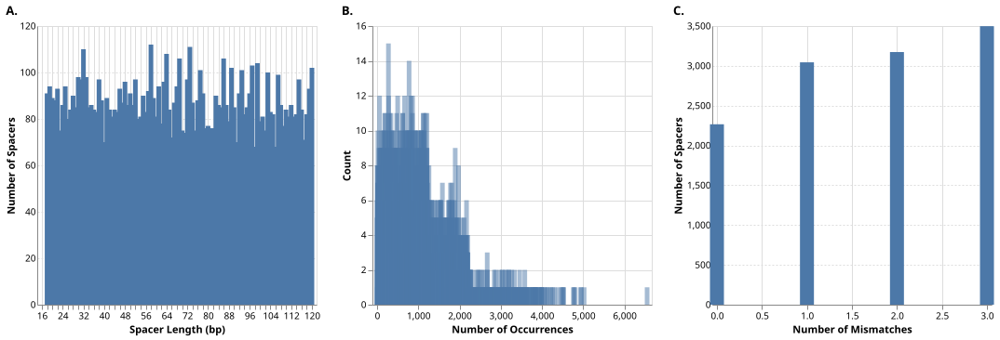

###  {#fig-supp-upset}

### Supplementary Figure S7: Spacer characteristic distributions by dataset {#fig-supp-spacer-distributions}

Distributions of spacers characteristics for both real (IMG/VR4) and simulated datasets.\
(A) Spacer size (length in bp)\
(B) Mismatches observed in spacer alignments\
(C) Spacer occurrence rate.

#### 1. IMG/VR4 dataset

Contigs:

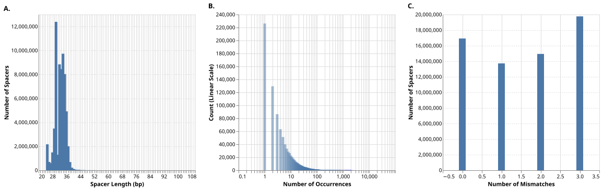

### Supplementary Figure S8: Upset plots showing tool result overlaps

Upset plot of tool performance for IMG/VR4 dataset. The panels (from top to bottom) are sorted by number of mismatches. The sets in each panel are sorted from left to right by the set size. Each row in each panel represents a tool, and the vertical lines connecting the dots indicate the intersection of the connected tool results'.

#### A. 0 mismatches

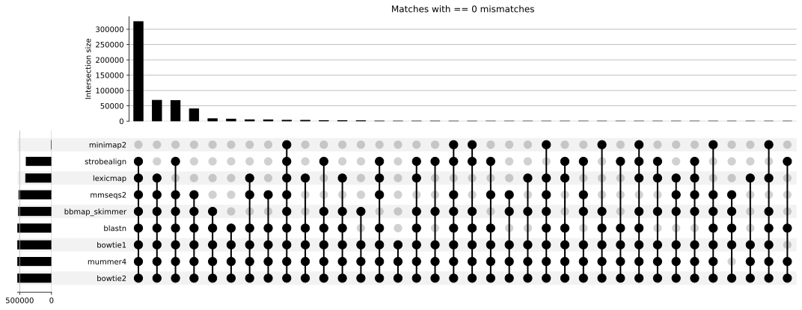

#### B. 1 mismatch

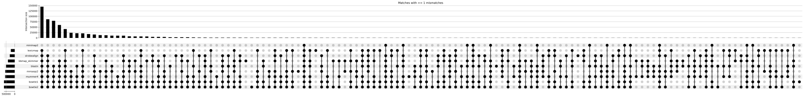

#### C. 2 mismatches

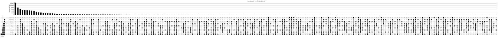

#### D. 3 mismatches

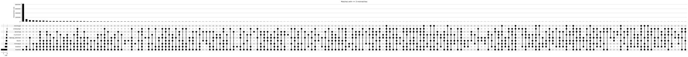

### Supplementary Figure S9: Tool-vs-tool comparison matrices for IMG/VR4 at exact mismatch levels {#fig-supp-real-matrix-exact}

\<merge matrices for exact mismatch values 0, 1, 2, 3 into single combined figure similar to main text Figure 3 panel B but showing separate panels for each exact hamming distance value\>

IMG/VR4 based results in a tool vs tool comparison at exact mismatch values. Unlike the main text figure which shows cumulative results (up to X mismatches), these matrices show results for exact mismatch values. Cell(i,j) represents the number of spacer-contig pairs identified by tool i (row) but not by tool j (column) at the specified exact hamming distance.

### Supplementary Figure S10: Distribution of spacer occurrence frequencies showing rarity of ultra-high occurrence spacers {#fig-supp-occurrence-distribution}

Distribution of spacer occurrence frequencies in the IMG/VR4 dataset demonstrating that ultra-high occurrence spacers (\>1000 occurrences) represent less than 0.01% of all spacers. This figure contextualizes the occurrence-dependent performance analysis presented in the main text, showing that while performance degradation at high occurrence frequencies is measurable, it affects only an extremely small fraction of analyses.

The panel set contains three complementary summaries for fraction_1 matched spacers (histogram/statistics views) to show both the long-tail behavior and the low absolute prevalence of ultra-high-occurrence spacers.

### Supplementary Figure S15: CPU time scaling including minimap2 {#fig-supp-resource-w-minimap2}

CPU-time scaling with minimap2 included. (A) Real IMG/VR4 subsampled datasets. (B) Simulated datasets. Minimap2 was excluded from the main text CPU figure due to overall poor performance in spacer-protospacer detection (see main text and Performance_simulated_v2.ipynb, Performance_imgvr4_v2.ipynb); it is included here for completeness of computational resource comparison.

### Supplementary Figure S16: Peak memory scaling (real and simulated datasets) {#fig-supp-resource-memory}

Peak-memory scaling shown (A) Real IMG/VR4 subsampled datasets. (B) Simulated datasets. Axes are log-scaled and tool identity is encoded by marker shape and color.

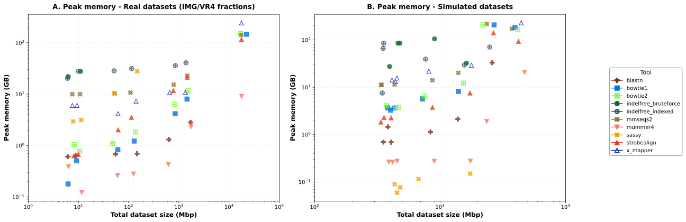

### Supplementary Figure S17: Real data resource usage detail {#fig-supp-resource-detail-real}

Individual resource usage plots for real IMG/VR4 subsampled datasets. (A) Total CPU time vs total contig size. (B) Peak memory vs total contig size. (C) Peak memory vs total CPU time (marker size proportional to dataset size). All axes are log-scaled. See Supplementary Table S8 for exact values.

<merge resource_usage_real_cpu_vs_size.svg, resource_usage_real_memory_vs_size.svg, and resource_usage_real_memory_vs_cputime.svg in three-panel layout, with labels A, B, C>

### Supplementary Figure S18: Simulated data resource usage detail {#fig-supp-resource-detail-sim}

Individual resource usage plots for simulated datasets. (A) Total CPU time vs search space size (spacers x contigs). (B) Peak memory vs search space size. (C) Peak memory vs total CPU time (marker size proportional to search space). All axes are log-scaled. See Supplementary Table S8 for exact values.

<merge resource_usage_sim_cpu_vs_searchspace.svg, resource_usage_sim_memory_vs_searchspace.svg, and resource_usage_sim_memory_vs_cputime.svg in three-panel layout, with labels A, B, C>

## Supplementary Notes

### Supplementary Note 1: Coordinate Tolerance Matching Example {#note-supp-coord-tolerance}

To illustrate the necessity for coordinate tolerance matching, consider the following case from one of the synthetic dataset (ns_100000_nc_10000) where three different tools detected the same ground truth region, but reported it with slightly different coordinates:

| Source | Spacer ID | Contig ID | Query Start | Query End | Target Start | Target End | Strand | Mismatches/Cost (tool-reported) | Notes |
|:-------|:-------|:-------|-------:|-------:|-------:|-------:|:-------|-------:|:-------|
| Ground Truth | 1c47e31b_spacer_10034 | 1c47e31b_contig_1828 | \- | \- | 5001 | 5036 | reverse | 1 |  |
| BLASTn | 1c47e31b_spacer_10034 | 1c47e31b_contig_1828 | 1 | 34 | 5036 | 5003 | reverse | 0 |  |
| MMseqs2 | 1c47e31b_spacer_10034 | 1c47e31b_contig_1828 | 1 | 35 | 5036 | 5002 | reverse | 1 |  |
| Sassy | 1c47e31b_spacer_10034 | 1c47e31b_contig_1828 | \- | \- | 5000 | 5036 | reverse | 1 | CIGAR: 34=1I1= |

In this example, BLASTn reports the ungapped alignment at contig positions 5003-5036 (0 reported mismatches), MMseqs2 reports 5002-5036 (1 reported mismatch over the terminal base), and Sassy reports 5000-5036 (1 reported insertion, suggesting the position 5000 in the contig matches that of the last position in the spacer). The ground truth planned occurrence was at 5001-5036. Despite these coordinate variations, all three tools detected the same biological match. **Critically**, all three tools report alignments that are acceptable matches to the ground truth occurrence, under a maximum hamming distance of 1.

This example demonstrates why a 5bp coordinate tolerance is necessary when aggregating results across tools to avoid double-counting essentially identical matches while accounting for valid algorithmic differences in gap versus substitution placement at alignment boundaries.

### Supplementary Note 2: Anecdotal observations on frame-preserving indels {#note-supp-frame-indels}

<PLACE_HOLDER> <!-- Should describe:
- Observations of indels in multiples of 3bp (frame-preserving) in phage escape contexts
- Why these are rare but potentially strong indicators of selection
- Any specific examples from the datasets
- Why this hasn't been previously reported in literature
- Potential biological significance

Referenced in main text introduction regarding phage mutation patterns
-->

### Supplementary Note 3: Non-planned Match Rate Analysis {#note-supp-nonplanned}
#### Hamming vs edit distance: per-simulation results

For each of the four fully synthetic simulations (ns_50000_nc_5000, ns_75000_nc_5000, ns_100000_nc_10000, ns_100000_nc_20000), we compared non-planned match counts under hamming distance (substitutions only) and edit distance (allowing indels) at thresholds 0 through 5. Across all simulations, edit distance consistently yielded higher non-planned match counts than hamming distance at the same numeric threshold, with the discrepancy increasing at higher thresholds.

##### Supplementary Figure S11: Per-simulation non-planned match counts (Hamming vs Edit) {#fig-supp-per-sim-background}

Each panel below shows one simulation. Grouped bars compare hamming (blue) and edit (orange) distance non-planned match counts at each threshold (0--5, log scale). Annotations above each bar indicate exact counts. 

###### A. ns_50000_nc_5000: 50,000 spacers (1.6 Mbp), 5,000 contigs (403 Mbp)

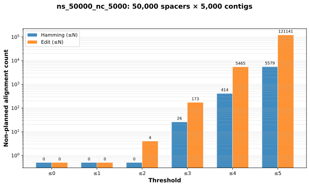

###### B. ns_75000_nc_5000: 75,000 spacers (2.4 Mbp), 5,000 contigs (401 Mbp)

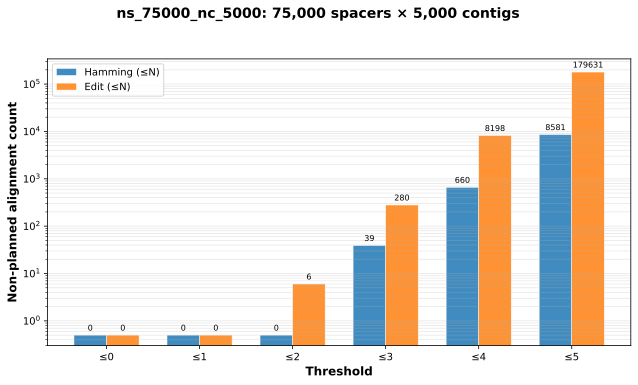

###### C. ns_100000_nc_10000: 100,000 spacers (3.2 Mbp), 10,000 contigs (803 Mbp)

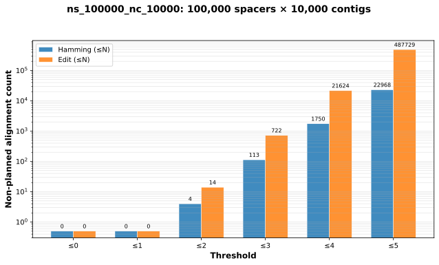

###### D. ns_100000_nc_20000: 100,000 spacers (3.2 Mbp), 20,000 contigs (1.6 Gbp)

#### Aggregated hamming vs edit distance comparison

Supplementary Figure S12 summarizes the mean ± SD non-planned match count across all four simulations at each threshold, for both hamming and edit distance.

##### Supplementary Figure S12: Aggregated non-planned match counts (mean ± SD across simulations) {#fig-supp-aggregated-background}

![Grouped bar chart showing the mean number of non-planned matches (log scale) at each distance threshold (0--5), comparing hamming distance (blue) and edit distance (orange). Error bars indicate standard deviation across the four fully synthetic simulations. At hamming distance ≤3, the mean count is approximately 91 (SD 64); at edit distance ≤3, it is approximately 642 (SD 480), a roughly 7-fold increase. At threshold ≤5, hamming yields approximately 20,411 (SD 15,391) while edit yields approximately 438,393 (SD 334,451), a roughly 21-fold increase. Data: `background_alignment_summary.csv`.](../main/figures/background_alignment_hamming_vs_edit.svg)

#### Search-space-normalized non-planned match rates

To account for differences in dataset size across simulations, we normalized non-planned match counts using the three metrics described above. Supplementary Figure S13 presents the mean ± SD across simulations at each threshold for all three metrics, separately for hamming and edit distance.

##### Supplementary Figure S13: Search-space-normalized non-planned match rates {#fig-supp-search-space-normalization}

![Three-panel grouped bar chart showing search-space-normalized non-planned match rates (mean ± SD across four simulations) at distance thresholds 0--5, comparing hamming (blue) and edit (orange) distance. Panel A: absolute count. Panel B: per spacer per Gbp target. Panel C: per Gbp$^2$ search space. For hamming distance ≤3, the per Gbp$^2$ rate is approximately 40,300 (i.e. approximately 40,300 non-planned matches per Gbp of spacer sequence searched against Gbp of contig sequence). Numerical values for all simulations and thresholds are provided in `search_space_normalized_metrics.csv`.](../main/figures/search_space_background_normalization.svg)

##### Supplementary Table S6: Search-space-normalized metrics at hamming/edit distance ≤3 {#tbl-supp-normalized-threshold3}

The table below summarizes the normalized non-planned match rates at distance threshold ≤3 for each simulation, extracted from the full dataset in `search_space_normalized_metrics.csv`. The threshold ≤3 subset is also available as `search_space_normalized_metrics_threshold3.csv`.

| Simulation | Metric | n_spacers | contig_bp (Gbp) | Non-planned | Per spacer per Gbp | Per Gbp$^2$ |
|:-----------|:-------|----------:|----------------:|------------:|-------------------:|------------:|
| ns_50000_nc_5000 | Hamming | 50,000 | 0.40 | 26 | 0.0013 | 40,371 |
| ns_50000_nc_5000 | Edit | 50,000 | 0.40 | 173 | 0.0086 | 268,621 |
| ns_75000_nc_5000 | Hamming | 75,000 | 0.40 | 39 | 0.0013 | 40,489 |
| ns_75000_nc_5000 | Edit | 75,000 | 0.40 | 280 | 0.0093 | 290,692 |
| ns_100000_nc_10000 | Hamming | 100,000 | 0.80 | 113 | 0.0014 | 43,968 |
| ns_100000_nc_10000 | Edit | 100,000 | 0.80 | 722 | 0.0090 | 280,929 |
| ns_100000_nc_20000 | Hamming | 100,000 | 1.60 | 187 | 0.0012 | 36,427 |
| ns_100000_nc_20000 | Edit | 100,000 | 1.60 | 1,393 | 0.0087 | 271,352 |

: Non-planned match rates at distance threshold ≤3 for each fully synthetic simulation. The per Gbp$^2$ metric is consistent across simulations for both hamming (approximately 40,000) and edit (approximately 270,000--290,000) distance, confirming that this metric appropriately normalizes for search space size. Edit distance ≤3 produces approximately 6--8 fold more non-planned matches than hamming distance ≤3.

##### Supplementary Figure S14: Semi-synthetic non-planned match counts (Hamming only) {#fig-supp-semisynthetic-background}

![Bar chart showing the number of non-planned hamming distance matches (log scale) in the semi-synthetic dataset at each threshold (0--5). At hamming distance 0: 1 match; ≤1: 49; ≤2: 2,354; ≤3: 56,273. Note that thresholds ≤4 and ≤5 were computed from the available heuristic tool outputs and represent lower bounds. The semi-synthetic dataset uses real (iPHoP-derived) spacer sequences which have biological sequence composition features (non-uniform base distribution, k-mer structure) that may differ from purely random sequences and therefore affect non-planned match frequencies.](figures/ns_3826979_nc_421431_real_baseline_hamming_background.svg)

##### Supplementary Table S7: Semi-synthetic non-planned match rates by hamming threshold {#tbl-supp-semisynthetic}

| Hamming threshold | Non-planned matches | Per spacer per Gbp | Per Gbp$^2$ |
|------------------:|--------------------:|-------------------:|------------:|
| 0 | 1 | 6.1 × 10$^{-8}$ | 1.80 |
| ≤1 | 49 | 3.0 × 10$^{-6}$ | 88.2 |
| ≤2 | 2,354 | 1.4 × 10$^{-4}$ | 4,236 |
| ≤3 | 56,273 | 3.4 × 10$^{-3}$ | 101,270 |
| ≤4 | 72,132 | 4.4 × 10$^{-3}$ | 129,810 |
| ≤5 | 113,314 | 6.9 × 10$^{-3}$ | 203,922 |

: Non-planned matches in the semi-synthetic dataset (3,826,979 real spacers × 421,431 simulated contigs, 0 planned spacer "injections") at cumulative hamming distance thresholds. The per Gbp$^2$ rate at hamming ≤3 (101,270) is higher than observed in the fully synthetic datasets (approximately 40,000), which is expected given differences in sequence composition between real and simulated spacers (e.g., non-uniform k-mer distribution, biological sequence features). Note: though to the sValues at thresholds ≤4 and ≤5 are **lower bounds** as only heuristic tools were used. {#tbl-supp-semisynthetic-rates}

#### Semi-synthetic vs fully synthetic comparison

The table below compares normalized non-planned match rates between the semi-synthetic dataset and the mean across fully synthetic simulations at hamming distance ≤3.

| Metric | Simulated (mean ± SD) | Semi-synthetic | Ratio |
|:-------|----------------------:|---------------:|------:|
| Absolute count | 91.3 ± 64.5 | 56,273 | n/a (different search space) |
| Per spacer per Gbp | 0.0013 ± 0.0001 | 0.0034 | 2.6× |
| Per Gbp$^2$ | 40,314 ± 2,791 | 101,270 | 2.5× |

: Comparison of non-planned match rates at hamming ≤3 between fully synthetic simulations (mean ± SD, n=4) and the semi-synthetic dataset. Absolute counts are not directly comparable due to different search space sizes. Normalized metrics show the semi-synthetic dataset has approximately 2.5× higher non-planned match rates, likely reflecting biological sequence composition features present in the real spacer set (iPHoP-derived) that are not fully captured by the simulated sequences (e.g., conserved motifs, non-uniform k-mer distributions, GC content variation within sequences).

#### Caveats and interpretation

These non-planned match rate estimates should be interpreted qualitatively rather than as exact predictive values, for several reasons:

1. **Sequence composition bias**: Real spacer sequences have compositional features (conserved motifs, non-random k-mer structure, locus-specific GC variation) not fully captured by simulated sequences. The approximately 2.5-fold difference between semi-synthetic and fully synthetic rates illustrates this effect.
2. **Simulated contig limitations**: While contig GC content and length distributions were matched to IMG/VR4, real viral genomes have additional structural features (coding density, gene arrangement, horizontal transfer footprints) that may influence match frequencies.
3. **Heuristic tool aggregation**: For the semi-synthetic dataset, only heuristic tools were computationally feasible. The reported counts are therefore lower bounds on the true non-planned match frequency.

These estimates are most informative for relative comparisons: hamming vs edit distance, threshold effects, and scaling with search space size. For absolute prediction of non-planned match counts in a given analysis, the rates should be treated as order-of-magnitude guides rather than precise values.

**Complete analysis available in:** `distance_metric_analysis_v3.ipynb` notebook in project repository, including per-distance breakdowns, tool-specific validation analyses, and detailed comparison tables.

## References and Data Availability

All analysis notebooks, source code, and generated data are available in the project repository at: [github.com/UriNeri/spacer_matching_bench](https://github.com/UriNeri/spacer_matching_bench).

Key analysis notebooks referenced in supplementary materials: - `spacer_inspection.ipynb`: Complexity filtering, spacer feature analysis, simulated vs real comparison - `distance_metric_analysis.ipynb`: Non-planned match rate analysis, coordinate tolerance examples, hamming vs edit distance comparison - `Prepare_all_jobs.ipynb`: Simulation parameter definitions, dataset generation commands - `Performance_simulated_v2.ipynb`: Per-tool performance metrics on simulated datasets - `Performance_imgvr4_v2.ipynb`: Per-tool performance metrics on real IMG/VR4 datasets

Dataset availability: - Filtered IMG/VR4 HQ contig subset (421,431 contigs, \~18.9 Gbp): \[Zenodo DOI\] - Filtered iPHoP spacer dataset (3,826,979 spacers, 132 Mbp): \[Zenodo DOI\] - All synthetic datasets and ground truth files: [@zenodo_doi]